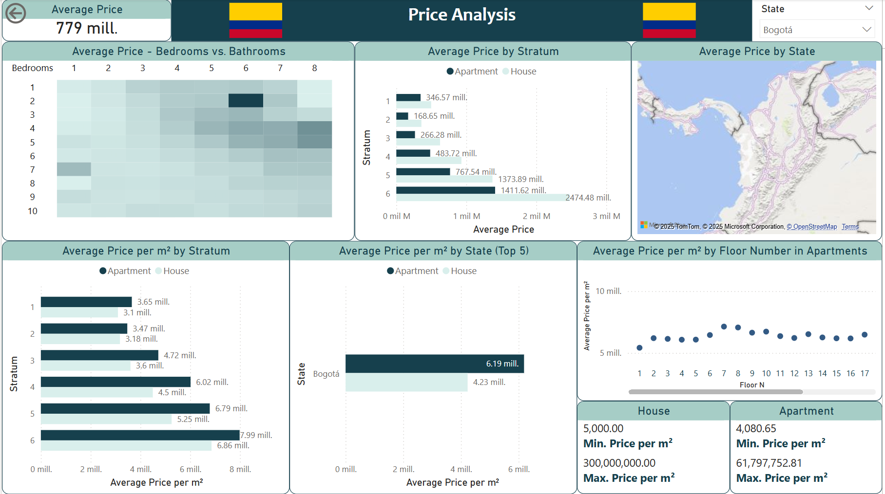

# **Feature Analysis**

## **1. Property Count**
- The dataset contains **94,358 properties**.
- Of these, **56,085 are apartments**, and **38,273 are houses**.
- The highest number of properties is located in **Bogota**, followed by **Cali and Medellin**.

## **2. Distribution of Rooms and Bathrooms**
- Most properties have **2 or 3 rooms**.
- The number of bathrooms correlates with the number of rooms, with most properties having **2 or 3 bathrooms**.
- Apartments tend to have fewer rooms than houses.

## **3. Rooms vs Socioeconomic Stratum**
- In lower stratum (**1 and 2**), most properties have **1 or 2 rooms**.
- In middle and upper stratum (**3, 4, 5, and 6**), more properties have **3 or more rooms**.
- This suggests a relationship between socioeconomic status and property size.

## **4. Property Age by Department**
- Bogota and Antioquia have a large number of properties **older than 30 years**.
- Newer properties (less than 1 year old) are less represented, indicating that the real estate market is dominated by older constructions.

## **5. Stratum vs Garages**
- In lower stratum (**1 and 2**), it is more common for properties **not to have garages**.
- In higher stratum (**4, 5, and 6**), most properties **have at least one garage**.

## **6. Geographical Distribution**
- Bogotá has the highest number of properties in the dataset, suggesting a more dynamic real estate market in this city.
- Other cities with significant representation include Cali, Medellín, Pereira, and Manizales.

## **Conclusions**
- **Bogota is the real estate hub**, with the highest number of properties.
- **Lower-stratum properties are smaller and have fewer garages**, while **higher-stratum properties tend to be larger and better equipped**.
- **Older properties dominate the market**, though there is a significant number of houses with an age between **9 and 30 years**.
- **Apartments outnumber houses**, but houses tend to be larger with more rooms.

## **Images**
### **1. General Distribution**

### **2. Apartments Only**

### **3. Houses Only**

---

# **Price Analysis**

## **1. General Analysis (No Filters)**
- **Average Price:**  **686 million.**
- **Distribution by Stratum (Average Price):**
  - **Stratum 6**: **1,980.78 million (house)** (highest).
  - **Stratum 1**: **251.48 million (apartment)** (lowest).
- **Price per Square Meter:**
  - **Apartments**: **2.72k - 69.5M.**
  - **Houses**: **5.0k - 300.0M.**
- **Most Expensive States by m²:**
  - **Antioquia**: **6.10M (apartments) / 5.23M (houses).**
  - **Bogota**: **6.19M (apartments) / 4.23M (houses).**
- **Pattern by Floor:**  
  - **Price increases up to the 10th floor, then stabilizes.**

---

## **2. Bogota (Filtered)**
- **Average Price:** **779 million** (slightly higher than the general analysis).
- **Distribution by Stratum (Average Price):**
  - **Stratum 6**: **2,474.48 million (house).**
  - **Stratum 1**: **346.57 million (apartment).**
- **Price per Square Meter:**
  - **Apartments**: **4.08k - 61.8M.**
  - **Houses**: **5.0k - 300.0M.**

---

## **3. Antioquia (Filtered)**
- **Average Price:** **964 million**
- **Distribution by Stratum:**
  - **Stratum 6**: **2,423.89 million (house).**
  - **Stratum 1**: **246.64 million (apartment).**
- **Price per Square Meter:**
  - **Apartments**: **5.3kM - 69.5M.**
  - **Houses**: **9.3k - 41.5M.**
- **Pattern by Floor:**  
  - **Price increases up to the 10th floor, then stabilizes.**

## **Conclusions**
- **Antioquia has the highest prices for square meter on average, especially for houses.**
- **Antioquia is more affordable but remains competitive.** 
- **Stratum 6 dominates the highest prices,** while Stratum 1 remains the most affordable.

## **Images**
### **1. General Distribution**

### **2. Bogota (Filtered)**

### **3. Antioquia (Filtered)**

